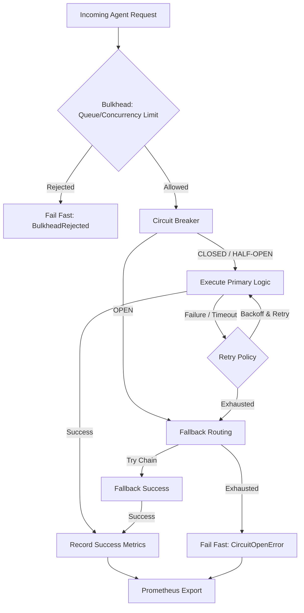

<div align="center">

# AgentArmor 🛡️

**Enterprise-Grade Fault Tolerance and Resilience for AI Agents**

Wrap any AI agent or LLM call with true production resilience: **Circuit Breakers, Bulkheads (Concurrency Limits), Exponential Backoff Retries, Fallback Chains, and Native Prometheus Metric Export**.

When your primary model or tool API falters, AgentArmor seamlessly shifts traffic, sheds load, and ensures zero downtime without changing your core agent logic.

[](https://pypi.org/project/agentarmor/)
[](LICENSE)
[](https://www.python.org/downloads/)
[](https://github.com/astral-sh/ruff)

[Quick Start](#-quick-start) · [Architecture](#-architecture) · [Resilience Patterns](#-resilience-patterns) · [Observability](#-observability-metrics)

</div>

---

## 🔥 The "Fragile Agent" Problem

AI pipelines face cascading failure points: rate-limited LLMs (429s), hallucinatory parsing, third-party API instability, and sudden latency spikes. Without structural safeguards, an otherwise intelligent agent will catastrophically fail at the first unhandled timeout.

**AgentArmor** translates decades of battle-tested microservice reliability concepts (like Hystrix or Resilience4j) into a lightweight, asyncio-native framework tailored for the unique failure modes of Generative AI systems.

Just one decorator hardens your pipeline.

```python
from agentarmor import shield

@shield(
    retries=3,
    backoff="exponential",     # 1s, 2s, 4s...
    fallback_model="gpt-4o-mini",
    circuit_threshold=4,       # Open circuit after 4 failures
    circuit_timeout=60,        # Test recovery after 60s
    max_concurrency=10,        # Shed load via Bulkhead if >10 concurrent execution requests
    timeout=30                 # Enforce hard 30s deadline
)
async def my_agent(input: str) -> str:
    return await volatile_gpt4_call(input)
```

**Zero changes to your internal logic. Total protection from external anomalies.**

---

## ⚡ Quick Start

```bash
pip install agentarmor
```

### The Wrapper API (For Advanced Control)

Define intricate resilience policies explicitly for maximum modular control:

```python
from agentarmor import CircuitBreaker, RetryPolicy, FallbackChain, Bulkhead

# 1. Define Retry strategy with Decorrelated Jitter
retry = RetryPolicy(
    max_retries=3,
    backoff="exponential",
    jitter=True,
    retry_on=[429, 500, 502, 503, 504],
)

# 2. Define Model Downgrades / Fallbacks
fallback = FallbackChain([
    {"model": "gpt-4o", "provider": "openai"},                # Primary
    {"model": "claude-3-5-sonnet-latest", "provider": "anthropic"}, # Cross-provider HA
    {"model": "gpt-4o-mini", "provider": "openai"},           # Cheap fallback
])

# 3. Establish Concurrency Compartments (Bulkhead)
bulkhead = Bulkhead(max_concurrency=20, max_wait_queue=50)

# 4. Integrate into a Circuit Breaker State Machine
breaker = CircuitBreaker(
    name="financial-analysis-agent",
    failure_threshold=5,
    recovery_timeout=45,
    half_open_max_calls=2,
    retry_policy=retry,
    fallback_chain=fallback
)

# Execute payload securely
result = await breaker.call(agent_function, query="Q4 earnings analysis")
```

---

## 🏛️ Architecture

AgentArmor orchestrates requests through a sophisticated layered state machine:



---

## 🛡️ Resilience Patterns

### 1. Circuit Breaker (`CircuitBreaker`)
Safeguards downstream LLMs/APIs from being hammered during outages. Features robust `CLOSED -> OPEN -> HALF_OPEN -> CLOSED` state tracking.

### 2. Bulkhead Pattern (`Bulkhead`)
Isolates resources. By limiting concurrent executions for a specific agent type, one rogue prompt loop won't starve your entire infrastructure of connection threads.

### 3. Model Fallback Chains (`FallbackChain`)
Never return a 500 error to a user if you can gracefully degrade. Shift seamlessly between OpenAI, Anthropic, or local open-source models based on availability.

### 4. Exponential Backoff & Jitter (`RetryPolicy`)
Retries transient failures with intelligent pacing to avoid thundering herd scenarios that exacerbate rate limiting.

---

## 📊 Observability (Metrics & Dashboards)

AgentArmor provides **native Prometheus metrics** out-of-the-box. If `prometheus-client` is installed, simply scrape the default registry:

```python
# Metrics automatically exposed:
# - agentarmor_calls_total (Counter)
# - agentarmor_successes_total (Counter)
# - agentarmor_failures_total (Counter)
# - agentarmor_fallback_total (Counter)
# - agentarmor_call_latency_seconds (Histogram)
# - agentarmor_circuit_state (Gauge: 0=CLOSED, 1=OPEN, 2=HALF_OPEN)
```

Additionally, AgentArmor includes a Rich-enabled text dashboard for CLI/Debug monitoring:

```python
from agentarmor import HealthMonitor

monitor = HealthMonitor()
monitor.register(my_breaker)
monitor.print_status()

# ┌──────────────────────────────────────────────────┐
# │ Circuit Breaker Health                           │
# ├────────────┬─────────────┬──────────┬────────────┤
# │ Agent      │    State    │ Failures │ Succ. Rate │
# ├────────────┼─────────────┼──────────┼────────────┤
# │ financial  │  CLOSED ✅  │    0     │   99.8%    │
# │ coding_bot │ HALF_OPEN⚠️ │    5     │   62.1%    │
# └────────────┴─────────────┴──────────┴────────────┘
```

---

## 🆚 Comparison

| Feature Capability | **AgentArmor** | Tenacity | Resilience4j | Letta/LangGraph |
|--------------------|:---:|:---:|:---:|:---:|
| Lang/Ecosystem | Python | Python | Java | Python |
| Agent/LLM First | ✅ | ❌ | ❌ | Partial |
| Circuit Breaking | ✅ | ❌ | ✅ | ❌ |
| Model Downgrades | ✅ | ❌ | ❌ | ❌ |
| Concurrency (Bulkhead) | ✅ | ❌ | ✅ | ❌ |
| Native Prom Metrics | ✅ | ❌ | ✅ | ❌ |

---

## 🗺️ Roadmap & Future Vision

- [x] Context Manager APIs (`async with breaker:`)
- [x] Prometheus Metrics Out-of-the-box
- [x] Bulkhead Concurrency Shedding
- [ ] Redis-backed Distributed Circuit State (for multi-worker sync)
- [ ] OpenTelemetry Tracing Native Integration
- [ ] Token-aware Bulkheads / TPM restrictions

## License

[MIT](LICENSE)

*Built for the next frontier of autonomous systems. Expect failure. Engineer resilience.*
